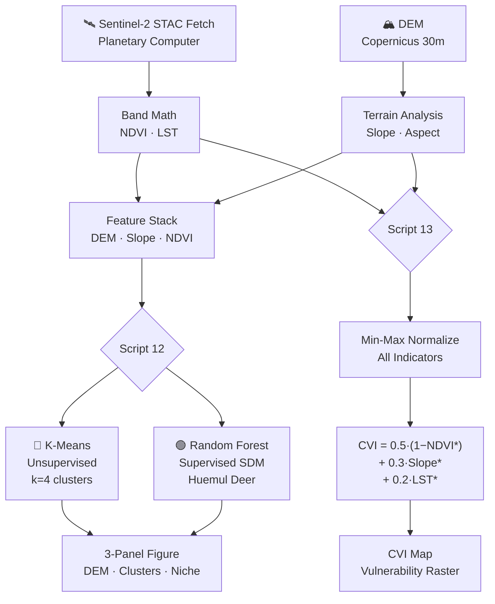

# 🌿 Chapter 4: Ecological Niche & Climate Vulnerability

> **Curriculum:** Geospatial Python for Climate & Environmental Intelligence
> **Chapter:** 04 of 12
> **Prerequisite:** Chapter 3 — Remote Sensing Indices & Land Cover Analysis

---

## 🗺️ Overview

This chapter bridges **machine learning** and **spatial ecology** by applying two distinct classification paradigms — unsupervised clustering and supervised prediction — to real Patagonian terrain. You will then synthesize raster-derived environmental indicators into a defensible **Climate Vulnerability Index (CVI)** using Multi-Criteria Decision Analysis (MCDA).

By the end of this chapter you will be able to:

- Distinguish when to use **unsupervised** vs. **supervised** spatial classification and articulate the epistemic assumptions behind each
- Train a **Random Forest Species Distribution Model (SDM)** and interpret its feature importance ranking
- Derive a **weighted composite vulnerability index** following the analytic hierarchy process (AHP) framework
- Recognize and explain the **data leakage trap** common in ecological modeling workflows
- Export publication-quality multi-panel raster figures with `matplotlib`

---

## 📁 Chapter Scripts

| # | File | Method | Output |
|---|------|--------|--------|
| 12 | `12_ecological_niche_modeling.py` | K-Means + Random Forest | 3-panel figure (DEM · clusters · niche) |
| 13 | `13_climate_vulnerability_index.py` | MCDA weighted overlay | CVI raster + map figure |

---

## 🛠️ Environment Setup

Install all required packages into the shared `geocascade_env` environment with:

```bash
mamba install -n geocascade_env -c conda-forge \
    scikit-learn rasterio numpy matplotlib \
    pystac-client planetary-computer pyproj -y
```

Activate the environment before running any script:

```bash
conda activate geocascade_env
```

> [!IMPORTANT]
> All scripts in this chapter assume the environment above is active. Running with a base or mismatched environment will likely raise `ModuleNotFoundError` for `rasterio` or `pystac_client`.

---

## 📜 Script 12 — `12_ecological_niche_modeling.py`

### Purpose

Demonstrates **two complementary machine learning approaches** to spatial habitat classification using the same set of raster inputs (DEM, Slope, NDVI). Running both approaches side-by-side is intentional — it forces a direct comparison of what each paradigm can and cannot tell you about landscape ecology.

### 🔵 Part A — Unsupervised: K-Means Terrain Clustering

K-Means partitions pixels into *k* = 4 clusters purely from the geometry of feature space, **without any labeled training data**. This is appropriate when:

- You have no prior species observations or field surveys
- You want to discover natural landscape classes rather than confirm hypotheses
- You are performing exploratory spatial data analysis (ESDA)

#### Feature Matrix

Each pixel is represented as a three-dimensional feature vector:

$$\mathbf{x}_i = \left[\, \text{DEM}_i^{*},\; \text{Slope}_i^{*},\; \text{NDVI}_i^{*} \,\right]$$

where $^{*}$ denotes min–max normalization to $[0, 1]$:

$$x^{*} = \frac{x - x_{\min}}{x_{\max} - x_{\min}}$$

#### Why Normalization is Non-Negotiable

K-Means minimizes the **within-cluster sum of squared Euclidean distances**:

$$J = \sum_{k=1}^{K} \sum_{\mathbf{x}_i \in C_k} \left\| \mathbf{x}_i - \boldsymbol{\mu}_k \right\|^2$$

Because the distance metric treats all dimensions equally, a feature measured in metres (DEM: 0–4000 m) would completely dominate a feature measured in the range [−1, 1] (NDVI) if left unnormalized. **Min–max scaling equalizes the contribution of each predictor to the distance calculation.**

> [!WARNING]
> Skipping normalization before K-Means produces clusters that reflect measurement units, not ecological structure. Always scale features before computing distances.

#### Cluster Interpretation

After fitting, each cluster centroid is inspected in original (unscaled) feature space to assign ecological labels. Typical Patagonian terrain classes at *k* = 4 might emerge as:

| Cluster | DEM (m) | Slope (°) | NDVI | Interpretation |
|---------|---------|-----------|------|----------------|
| 0 | Low | Low | High | Riparian / valley meadow |
| 1 | Low | Moderate | Low | Degraded steppe |
| 2 | High | High | Low | Rocky alpine / scree |
| 3 | Moderate | Moderate | High | Shrubland / forest edge |

> [!NOTE]
> Cluster labels are arbitrary integers. Their ecological interpretation requires domain knowledge; the algorithm assigns no semantic meaning to cluster IDs.

---

### 🟢 Part B — Supervised: Random Forest Species Distribution Model (SDM)

A **Species Distribution Model (SDM)** predicts the probability that a species is present at a given location, given its environmental conditions. The Random Forest classifier approximates this probability by averaging predictions across an ensemble of decision trees.

#### Simulated Training Data — Patagonian Huemul Deer (*Hippocamelus bisulcus*)

In the absence of real GPS collar data, presence/absence labels are **simulated** from known ecological preferences of the Patagonian Huemul Deer:

| Preference | Rule used in simulation |
|------------|------------------------|
| Low–mid elevation | Presence likely if DEM < 1200 m |
| Gentle terrain | Presence likely if Slope < 15° |
| Dense vegetation | Presence likely if NDVI > 0.3 |

These rules generate the training labels programmatically, making this a **closed-form pedagogical device**.

> [!CAUTION]
> **Data Leakage Warning.** The simulated presence/absence labels are derived from the same DEM, Slope, and NDVI rasters used as model inputs. This creates **circular reasoning**: the model will perfectly recover the rules it was trained on, and reported accuracy metrics are meaningless. This workflow is valid only as a teaching illustration. **In real research, field observations must be independent of the predictor rasters.**

#### Random Forest Prediction

After training, the model produces a **habitat suitability probability map** $P(\text{presence} \mid \mathbf{x})$ at every pixel:

$$\hat{p}_i = \frac{1}{T} \sum_{t=1}^{T} f_t(\mathbf{x}_i)$$

where $T$ is the number of trees and $f_t(\mathbf{x}_i) \in \{0, 1\}$ is the vote of the $t$-th tree.

#### Feature Importance

Random Forest computes **mean decrease in impurity (MDI)** for each predictor. Results are printed as a console bar chart and reflect which environmental variable most strongly partitions presence from absence:

```
Feature Importance (Random Forest SDM)
=======================================
NDVI     ████████████████████ 0.52
DEM      ████████████   0.31
Slope    ███████   0.17
```

Higher importance = that predictor provides more information about habitat suitability conditional on the others.

> [!TIP]
> MDI importance can be biased toward high-cardinality continuous features. For publication-quality SDMs, consider **permutation importance** (`sklearn.inspection.permutation_importance`) as a more reliable alternative.

#### SDM Prevalence

**Prevalence** is the proportion of presence points in the training dataset:

$$\text{Prevalence} = \frac{N_{\text{presence}}}{N_{\text{presence}} + N_{\text{absence}}}$$

Prevalence affects model calibration. A prevalence close to 0.5 (balanced classes) produces well-calibrated probability estimates. Very low prevalence (rare species) requires stratified sampling or class-weight adjustment. Scikit-learn's `class_weight='balanced'` parameter can compensate automatically.

#### Output Figure

The script exports a **3-panel figure**:

```
┌─────────────┬──────────────────┬─────────────────────┐
│  Panel 1    │    Panel 2       │      Panel 3        │
│  DEM        │  K-Means         │  RF Habitat         │
│  (terrain)  │  Clusters (k=4)  │  Suitability (0–1)  │
└─────────────┴──────────────────┴─────────────────────┘
```

### Run Command

```bash
python 12_ecological_niche_modeling.py
```

Expected runtime: ~60–120 s (dominated by Sentinel-2 STAC fetch and RF training).

---

## 📜 Script 13 — `13_climate_vulnerability_index.py`

### Purpose

Implements a **Multi-Criteria Decision Analysis (MCDA) Climate Vulnerability Index** by combining three normalized environmental indicators into a single composite score via a **weighted linear combination**. This approach mirrors the structure used in operational vulnerability frameworks (IPCC, WWF, CBD) and introduces the **Analytic Hierarchy Process (AHP)** as a principled method for assigning indicator weights.

### Indicators Used

| Indicator | Raster Source | Ecological Rationale |
|-----------|--------------|----------------------|
| NDVI | Sentinel-2 (B8, B4) | Low vegetation → high exposure |
| Slope | Derived from DEM | Steep terrain → high sensitivity |
| LST | Derived from thermal band | High temperature → high hazard |

### CVI Formula

$$\boxed{\text{CVI} = 0.5 \cdot (1 - \text{NDVI}^{*}) + 0.3 \cdot \text{Slope}^{*} + 0.2 \cdot \text{LST}^{*}}$$

where every indicator is first min–max normalized to $[0, 1]$:

$$I^{*} = \frac{I - I_{\min}}{I_{\max} - I_{\min}}$$

Note that **NDVI is inverted** $(1 - \text{NDVI}^*)$ because high vegetation cover is associated with **lower** ecological vulnerability — the transformation aligns all indicators so that larger values always indicate greater vulnerability.

### Weight Interpretation (AHP Framework)

The weights $\{0.5,\; 0.3,\; 0.2\}$ satisfy the fundamental constraint:

$$\sum_{j=1}^{n} w_j = 1, \qquad w_j \geq 0$$

They are **illustrative** of the Saaty (1980) Analytic Hierarchy Process, in which pairwise comparisons between criteria are translated into a normalized priority vector. A formal AHP workflow would:

1. Construct an $n \times n$ pairwise comparison matrix $\mathbf{A}$
2. Compute the principal eigenvector $\mathbf{w}$ such that $\mathbf{A}\mathbf{w} \approx \lambda_{\max}\mathbf{w}$
3. Calculate the **Consistency Ratio (CR)** — a CR < 0.10 indicates acceptably consistent expert judgment

> [!NOTE]
> The weights used in this script are not derived from a formal pairwise comparison exercise. In applied vulnerability assessments, weights should be validated through expert elicitation or stakeholder participatory processes, with CR reported alongside the final index.

### ⚠️ Critical Implementation Detail — `window=win_s2`

> [!CAUTION]
> **This is the most common error in this script.** Sentinel-2 tiles from the Planetary Computer STAC catalog cover entire ~110 km × 110 km scenes. Without specifying a spatial window, `rasterio.open(...).read()` loads the **entire tile into memory** — potentially several GB — and returns data for the wrong spatial extent.
>
> Every `rasterio` read in this script **must** pass the `window=win_s2` argument:
>
> ```python
> # ✅ Correct — reads only the AOI window
> band = src.read(1, window=win_s2)
>
> # ❌ Wrong — reads entire Sentinel-2 tile
> band = src.read(1)
> ```
>
> `win_s2` is computed by reprojecting the study area bounding box into the tile's CRS and converting it to a `rasterio.windows.Window` object before any reads occur. If you see a `MemoryError` or a map showing an unexpected region, this parameter is almost certainly missing.

### Run Command

```bash
python 13_climate_vulnerability_index.py
```

Expected runtime: ~45–90 s (STAC query + windowed reads + normalization).

---

## 🎓 Academic Concepts Reference

### Unsupervised vs. Supervised Classification

| Dimension | Unsupervised (K-Means) | Supervised (Random Forest) |
|-----------|----------------------|--------------------------|
| Training labels required | ❌ No | ✅ Yes |
| Output | Cluster IDs | Class probabilities |
| Interpretation | Exploratory | Predictive / confirmatory |
| Risk of overfitting | Low (no labels to memorize) | Moderate–High |
| Appropriate when | No prior knowledge exists | Labeled observations available |
| Evaluation metric | Silhouette score, inertia | AUC-ROC, TSS, Kappa |

### Species Distribution Modeling (SDM) — MaxEnt Analog

SDMs characterize the **realized ecological niche** of a species in environmental space (the Hutchinsonian niche) and project it back onto geographic space as a habitat suitability map. **MaxEnt** (maximum entropy modeling) is the most widely used SDM algorithm in ecology; the Random Forest approach in this chapter is a discriminative analog that produces comparable probability estimates when presence/absence data are both available.

Key SDM concepts to understand:

- **Niche conservatism:** the assumption that a species' environmental tolerances are stable over time — required to make future climate projections meaningful
- **Spatial autocorrelation:** nearby training points are not independent; spatial thinning or block cross-validation is needed for unbiased accuracy estimates
- **Extrapolation risk (MESS analysis):** predicting into climate conditions not represented in the training data yields unreliable outputs

### Multi-Criteria Decision Analysis (MCDA)

MCDA provides a transparent, reproducible framework for combining incommensurable indicators (temperature, vegetation, terrain) into a single decision-support metric. The **weighted linear combination (WLC)** used here is the simplest MCDA method. More sophisticated approaches include:

- **TOPSIS** (Technique for Order Preference by Similarity to Ideal Solution)
- **ELECTRE** (Elimination and Choice Expressing Reality)
- **Ordered Weighted Averaging (OWA)** — allows expression of risk attitude through ordered weights

### Data Leakage in Ecological Modeling

**Data leakage** occurs when information from the response variable (species presence) contaminates the predictor variables or vice versa, producing inflated accuracy estimates that do not generalize to new data. Common forms include:

1. **Target leakage:** predictors computed from the same dataset used to derive labels (as in Script 12)
2. **Temporal leakage:** training on future data to predict the past
3. **Spatial leakage:** training and test points too close together (ignoring spatial autocorrelation)

> [!IMPORTANT]
> The simulated labels in `12_ecological_niche_modeling.py` constitute deliberate target leakage. This is acceptable **only** in a pedagogical context where the goal is to illustrate the SDM workflow, not to produce scientifically valid habitat predictions.

---

## 🔬 Conceptual Workflow



---

## 📊 Expected Outputs

```
Chapter_04/
├── README.md                          ← This file
├── 12_ecological_niche_modeling.py
├── 13_climate_vulnerability_index.py
└── outputs/
    ├── ch04_niche_modeling.png        ← 3-panel: DEM | K-Means | RF SDM
    └── ch04_climate_vulnerability.png ← CVI composite map
```

---

## 🧪 Exercises

1. **Sensitivity analysis:** Change the CVI weights to $\{0.33, 0.33, 0.33\}$ (equal weighting). How does the vulnerability map change? Which pixels shift from low to high vulnerability or vice versa? What does this tell you about the influence of individual indicator weights?

2. **Optimal k selection:** Modify Script 12 to loop over $k \in \{2, 3, 4, 5, 6\}$ and compute the **silhouette score** for each. Plot silhouette score vs. *k*. Which value of *k* best captures the natural terrain structure of your study area?

3. **Class imbalance experiment:** In Script 12, change the RF classifier to `RandomForestClassifier(class_weight='balanced')`. Rerun and compare the habitat suitability probability map. Does balancing class weights change the spatial extent of predicted suitable habitat? Why?

4. **Leakage audit:** Redesign the SDM training pipeline to eliminate data leakage. Obtain actual Huemul Deer GPS observations from the [GBIF](https://www.gbif.org/) API and use them as independent presence points, paired with pseudo-absence points sampled from areas of confirmed non-detection. Retrain the RF model and compare AUC-ROC with the simulated pipeline.

5. **AHP weight derivation:** Construct a formal 3×3 pairwise comparison matrix for NDVI, Slope, and LST using Saaty's 1–9 scale. Compute the priority vector and Consistency Ratio. Do your expert-derived weights differ substantially from the $\{0.5, 0.3, 0.2\}$ values used in the script?

---

## 📚 Further Reading

| Topic | Reference |
|-------|-----------|
| MaxEnt SDM | Phillips, S.J., Anderson, R.P. & Schapire, R.E. (2006). *Maximum entropy modeling of species geographic distributions.* **Ecological Modelling**, 190(3–4), 231–259. |
| AHP Methodology | Saaty, T.L. (1980). *The Analytic Hierarchy Process.* McGraw-Hill. |
| Random Forest Ecology | Cutler, D.R. et al. (2007). *Random forests for classification in ecology.* **Ecology**, 88(11), 2783–2792. |
| MCDA in GIS | Malczewski, J. (1999). *GIS and Multicriteria Decision Analysis.* John Wiley & Sons. |
| Data Leakage in ML | Kaufman, S. et al. (2012). *Leakage in data mining: Formulation, detection, and avoidance.* **ACM TKDD**, 6(4), 1–21. |
| Spatial CV for SDM | Roberts, D.R. et al. (2017). *Cross-validation strategies for data with temporal, spatial, hierarchical, or phylogenetic structure.* **Ecography**, 40(8), 913–929. |
| Huemul Conservation | Flueck, W.T. & Smith-Flueck, J.A.M. (2006). *Huemul chronicles: Whither Patagonia's endangered deer?* **Journal of Wildlife Research.** |

---

## ⚡ Quick Reference — Key Formulas

| Formula | Expression |
|---------|-----------|
| Min–max normalization | $x^* = (x - x_{\min}) / (x_{\max} - x_{\min})$ |
| K-Means objective | $J = \sum_k \sum_{\mathbf{x} \in C_k} \|\mathbf{x} - \boldsymbol{\mu}_k\|^2$ |
| RF probability estimate | $\hat{p} = \frac{1}{T}\sum_{t=1}^T f_t(\mathbf{x})$ |
| SDM prevalence | $\text{Prev} = N_+ / (N_+ + N_-)$ |
| CVI weighted overlay | $\text{CVI} = 0.5(1-\text{NDVI}^*) + 0.3\,\text{Slope}^* + 0.2\,\text{LST}^*$ |
| AHP consistency ratio | $\text{CR} = \text{CI} / \text{RI}$, where $\text{CI} = (\lambda_{\max} - n)/(n-1)$ |
| Weight constraint | $\sum_j w_j = 1,\; w_j \geq 0$ |

---

*Chapter 4 of 12 — Geospatial Python for Climate & Environmental Intelligence*
*Last updated: July 2026*
