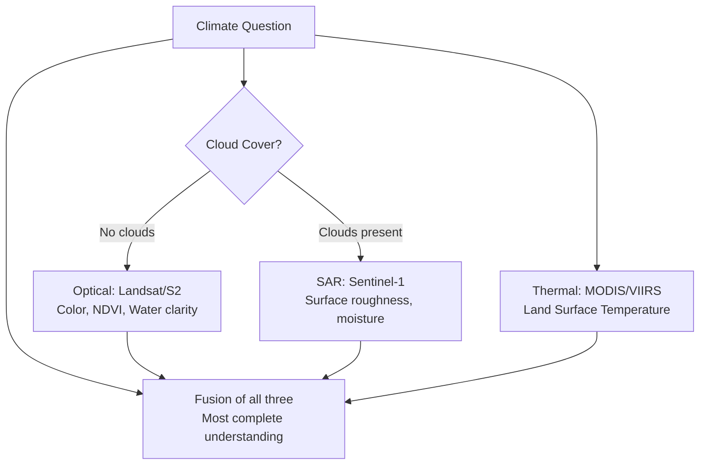

# 📡 Chapter 7: Radar & Multi-Sensor Review (SAR)

> *"Every sensor is a different pair of eyes looking at the same Earth — optical sees color, radar sees texture, thermal sees heat. No single sensor tells the whole story."*

---

## 🗺️ Chapter Overview

This chapter introduces **Synthetic Aperture Radar (SAR)** — the most powerful all-weather, day/night remote sensing technology available to climate scientists — and then synthesizes everything learned so far through a **multi-sensor comparison** that places optical, radar, and thermal data side-by-side over the same geographic extent and season.

By the end of this chapter you will understand:
- How SAR works physically and why it penetrates clouds
- How radar backscatter encodes surface type information
- The correct mathematical pipeline for dB conversion and resampling
- Why multi-sensor fusion is essential for robust climate monitoring

---

## 📂 Scripts in This Chapter

| # | Script | Sensor | Key Output |
|---|--------|--------|------------|
| 18 | `18_sentinel1_sar_processing.py` | Sentinel-1 (SAR, 10 m) | dB backscatter map + classified surface overlay |
| 19 | `19_multisensor_review.py` | Landsat 9 + Sentinel-1 + MODIS | 3-panel sensor comparison figure |

---

## ⚙️ Environment Setup

All dependencies are managed through the `geocascade_env` conda environment. Install with:

```bash
mamba install -n geocascade_env -c conda-forge \
    pystac-client \
    planetary-computer \
    rasterio \
    numpy \
    matplotlib \
    pyproj \
    osmnx \
    -y
```

Activate the environment before running any script:

```bash
conda activate geocascade_env
```

> [!NOTE]
> `pystac-client` and `planetary-computer` together provide authenticated access to Microsoft's Planetary Computer STAC catalog, where both Sentinel-1 RTC and Landsat Collection 2 assets are hosted. `osmnx` is used to fetch administrative boundary geometries for spatial subsetting.

---

## 🧭 Script 18 — `18_sentinel1_sar_processing.py`

### What It Does

This script downloads **Sentinel-1 RTC (Radiometrically Terrain Corrected)** VV-polarization backscatter tiles from the Planetary Computer catalog, converts the raw linear power values to the decibel (dB) scale, classifies the scene into surface-type categories, and exports both a continuous dB map and a discrete classified overlay.

### Running the Script

```bash
conda activate geocascade_env
python 18_sentinel1_sar_processing.py
```

### Outputs

| File | Description |
|------|-------------|
| `sentinel1_VV_dB.tif` | Continuous VV backscatter in dB (float32, clipped −30 to 0 dB) |
| `sentinel1_classified.tif` | Classified surface raster (3 classes, uint8) |
| `sentinel1_sar_map.png` | Visualization: dB backscatter + classified overlay side-by-side |

---

### 📡 Physics Deep Dive — How SAR Works

#### Active vs Passive Sensing

All optical sensors (Landsat, Sentinel-2, MODIS) are **passive** — they record solar radiation reflected from the Earth's surface. They are blind at night and cannot see through clouds or smoke.

SAR is an **active sensor**: it emits its own microwave pulses toward the surface and records the fraction of that energy that scatters back to the antenna. Because it generates its own illumination, SAR operates:

- ✅ At night
- ✅ Through clouds, rain, and smoke
- ✅ In polar winter (no solar illumination)
- ✅ Independent of atmospheric conditions

#### Why Microwaves Penetrate Clouds

Cloud droplets are typically **10–100 micrometers (μm)** in diameter. Sentinel-1 operates in **C-band** at a center frequency of ~5.405 GHz, corresponding to a wavelength of:

$$\lambda = \frac{c}{f} = \frac{3 \times 10^8 \text{ m/s}}{5.405 \times 10^9 \text{ Hz}} \approx 5.55 \text{ cm}$$

Because the radar wavelength (~55,000 μm) is **three to four orders of magnitude larger** than cloud droplets, the microwaves experience negligible Mie scattering and pass through cloud layers essentially unimpeded. Rain cells with drop diameters of 1–5 mm begin to attenuate C-band signals, but even in moderate rain the signal penetrates.

> [!NOTE]
> **Longer wavelengths penetrate deeper.** L-band SAR (~24 cm, used by ALOS-2 and NISAR) penetrates through forest canopies and into soils. P-band SAR (~70 cm) can measure ice sheet thickness. C-band (Sentinel-1) strikes a balance between cloud penetration and surface sensitivity, making it ideal for land/cryosphere monitoring.

---

### 📐 The dB Conversion Formula

Raw Sentinel-1 RTC data is delivered in **linear power units** (dimensionless radar cross-section normalized by area, σ⁰). To convert to the decibel scale:

$$\sigma^0_{\text{dB}} = 10 \cdot \log_{10}(\sigma^0_{\text{linear}})$$

In code:

```python
import numpy as np

# Load linear power (float32, values typically 0.0001 to 1.0)
sigma0_linear = band.read(1).astype(np.float32)

# Convert to dB BEFORE any resampling or reprojection
sigma0_dB = 10 * np.log10(sigma0_linear)

# Clip to physically meaningful range
sigma0_dB = np.clip(sigma0_dB, -30, 0)
```

> [!CAUTION]
> **Always convert to dB BEFORE resampling or reprojecting.** Bilinear interpolation averages neighboring pixel values. Averaging linear power values is physically valid (power is additive). Averaging dB values is mathematically incorrect — dB is a logarithmic scale and does **not** average linearly:
>
> $$10\log_{10}\!\left(\frac{a+b}{2}\right) \neq \frac{10\log_{10}(a) + 10\log_{10}(b)}{2}$$
>
> **Correct pipeline:** `Download → Clip to AOI → Convert to dB → Resample/Reproject → Save`  
> **Incorrect pipeline:** `Download → Resample → Convert to dB`

---

### 🏔️ Surface Classification by Backscatter

The VV-polarization backscatter level encodes the **physical roughness** and **dielectric properties** of the surface. This script uses the following thresholds:

| Class | dB Range | Physical Explanation |
|-------|----------|----------------------|
| 🌊 Water | `σ⁰ < −20 dB` | Calm water acts as a **specular reflector** — the flat surface acts like a mirror, deflecting nearly all radar energy *away* from the sensor. Almost no signal returns → very dark in radar images |
| 🧊 Glacier Ice | `−18 dB ≤ σ⁰ ≤ −12 dB` | Smooth glacial ice is moderately specular. Volume scattering within snow/firn layers adds a return component, resulting in intermediate backscatter values |
| 🌿 Vegetation | `σ⁰ > −12 dB` | Rough vegetation canopies produce **diffuse (Lambertian-like) scattering** — energy is scattered in many directions, and a significant fraction returns to the antenna → brighter in radar images |

```python
# Classification thresholds (VV dB)
classified = np.zeros_like(sigma0_dB, dtype=np.uint8)
classified[sigma0_dB < -20]                          = 1  # Water
classified[(sigma0_dB >= -18) & (sigma0_dB <= -12)]  = 2  # Glacier ice
classified[sigma0_dB > -12]                          = 3  # Vegetation
```

#### Specular vs. Diffuse Reflection — The Physics

```
Specular Reflection (Calm Water)       Diffuse Reflection (Vegetation)

    ↓↓ Radar pulse                         ↓↓ Radar pulse
    ___________                            🌿🌿🌿🌿🌿🌿
   ~~~~~~~~~~~     → → → →               ↗ ↑ ↖ ↑ ↗ ↑
   (reflected away from sensor)          (scattered in all directions)
                                          ↑ portion returns to sensor
   RESULT: Very dark pixel                RESULT: Bright pixel
   σ⁰ << −20 dB                          σ⁰ > −12 dB
```

> [!IMPORTANT]
> **VV vs VH Polarization:**  
> - **VV (vertical transmit, vertical receive):** Primarily sensitive to **surface roughness** and **dielectric constant** (moisture content). Best for water body detection, surface soil moisture, and sea ice mapping.  
> - **VH (vertical transmit, horizontal receive):** Primarily sensitive to **volume scattering** — energy that bounces multiple times within a 3D structure (forest canopy, tall crops, snow pack). Best for biomass estimation and vegetation structure.  
>
> This script uses VV. For vegetation biomass studies, VH (or the VH/VV ratio) is more diagnostic.

---

## 🔬 Script 19 — `19_multisensor_review.py`

### What It Does

This script queries **three independent sensors** for the **same bounding box (BBOX) and season**, processes each to a physically interpretable quantity, and produces a **3-panel side-by-side comparison figure** that illustrates why no single sensor is sufficient for comprehensive climate monitoring.

### Running the Script

```bash
conda activate geocascade_env
python 19_multisensor_review.py
```

### Outputs

| File | Description |
|------|-------------|
| `multisensor_comparison.png` | 3-panel figure: Landsat RGB / Sentinel-1 VV dB / MODIS LST (°C) |

---

### 🛰️ The Three Sensors Compared

#### Panel 1 — Landsat 9 (30 m Optical)

| Property | Value |
|----------|-------|
| Spatial resolution | 30 m |
| Spectral bands used | Blue (B2), Green (B3), Red (B4), NIR (B5) |
| Visualization | False-color RGB composite |
| What it captures | Surface reflectance, vegetation greenness (NDVI), water clarity |
| Limitation | **Blocked by clouds** — unusable under overcast skies |

```python
# False-color composite: NIR → Red channel, Red → Green, Green → Blue
# Highlights active vegetation in vivid red tones
rgb_false = np.stack([nir_band, red_band, green_band], axis=-1)
```

#### Panel 2 — Sentinel-1 SAR (10 m Radar)

| Property | Value |
|----------|-------|
| Spatial resolution | 10 m (IW mode) |
| Band | C-band, VV polarization |
| Visualization | Grayscale dB backscatter (−30 to 0 dB) |
| What it captures | Surface roughness, dielectric properties, moisture |
| Advantage | **Cloud-penetrating** — works in any weather, day or night |

#### Panel 3 — MODIS LST (1 km Thermal)

| Property | Value |
|----------|-------|
| Spatial resolution | 1 km |
| Product | MOD11A1 (Terra) or MYD11A1 (Aqua), Daily LST |
| Band | LST_Day_1km or LST_Night_1km |
| What it captures | Land Surface Temperature — thermal emission from surface |
| Limitation | Cloud-blocked (thermal IR cannot penetrate clouds); coarse spatial resolution |

---

### 🌡️ MODIS LST — Critical Data Handling

MODIS LST data is distributed as **scaled integer Digital Numbers (DN)** and requires two processing steps before any analysis:

**Step 1 — Apply the scale factor (DN → Kelvin):**

$$T_{\text{Kelvin}} = DN \times 0.02$$

**Step 2 — Convert to Celsius:**

$$T_{\text{Celsius}} = T_{\text{Kelvin}} - 273.15$$

```python
# Correct MODIS LST processing pipeline
lst_dn = band.read(1)          # Raw DN (uint16)

# Apply fill value mask FIRST — valid range is 7500–43200 DN
valid_mask = (lst_dn >= 7500) & (lst_dn <= 43200)

lst_kelvin  = lst_dn * 0.02                    # Scale to Kelvin
lst_celsius = lst_kelvin - 273.15              # Convert to Celsius

lst_celsius[~valid_mask] = np.nan             # Mask invalid pixels
```

> [!WARNING]
> **MODIS Fill Value: Use `DN < 7500`, NOT `DN == 0`.**
>
> A common and consequential mistake is masking only pixels where `DN == 0`. The MODIS LST product valid data range is **7500–43200 DN** (≈ 150 K to 864 K). Any DN value below 7500 is either a fill value, a cloud-contaminated pixel, or an out-of-range observation — **all of which must be masked**. If you only mask DN == 0:
>
> - DN values of 1–7499 (physically impossible temperatures of 0.02 K to ~149.98 K) will be treated as valid, producing wildly incorrect cold temperature artifacts.
> - Your mean LST will be biased severely cold, especially near cloud edges.
>
> **Correct mask:** `valid_mask = (lst_dn >= 7500) & (lst_dn <= 43200)`

---

### 🖼️ The 3-Panel Output Figure

```
┌─────────────────────────────────────────────────────────────┐
│         Multi-Sensor Comparison — [Study Area, Season]      │
├───────────────────┬─────────────────┬───────────────────────┤
│   Landsat 9       │  Sentinel-1 SAR │   MODIS LST           │
│   False Color     │  VV dB          │   Land Surface Temp   │
│   (NIR/R/G)       │  (−30 to 0 dB) │   (°C)                │
│                   │                 │                        │
│   30 m optical    │  10 m radar     │   1 km thermal         │
│   Cloud-blocked   │  All-weather    │   Cloud-blocked        │
│   Color/veg info  │  Roughness/wet  │   Heat signature       │
└───────────────────┴─────────────────┴───────────────────────┘
```

---

## 🎓 Academic Concepts Reference

### Synthetic Aperture Radar (SAR)

SAR is not a single aperture antenna — it synthesizes a **large virtual antenna** by combining pulses collected as the satellite moves along its flight path (azimuth direction). The synthetic aperture length $L_s$ is:

$$L_s = v \cdot T_a$$

where $v$ is the platform velocity and $T_a$ is the coherent integration time. This allows SAR to achieve **meter-scale azimuth resolution** from a satellite orbiting hundreds of kilometers away — a feat impossible with a physically small real-aperture antenna at those ranges.

The resulting azimuth resolution is approximately:

$$\delta_{az} \approx \frac{D_a}{2}$$

where $D_a$ is the physical antenna length. Paradoxically, **smaller physical antennas yield better SAR resolution** (longer synthetic aperture), because a smaller antenna has a wider beam and illuminates each ground target for longer.

### Polarimetry

| Polarization | Transmit | Receive | Sensitive To |
|---|---|---|---|
| VV | Vertical | Vertical | Surface roughness, dielectric constant, soil moisture |
| HH | Horizontal | Horizontal | Flat surfaces, sea ice, urban structures |
| VH | Vertical | Horizontal | Volume scattering: forest canopy, tall crops, snow |
| HV | Horizontal | Vertical | Volume scattering (similar to VH) |

Sentinel-1 IW (Interferometric Wide Swath) mode acquires both **VV + VH** simultaneously, enabling dual-polarization analysis.

### The Decibel Scale in Remote Sensing

The dB scale is used because radar backscatter spans many orders of magnitude across surface types. In linear power, calm water might return $\sigma^0 = 10^{-4}$ while dense forest returns $\sigma^0 = 0.1$ — a factor of 1,000. In dB:

$$\sigma^0_{\text{dB}} = 10 \cdot \log_{10}(10^{-4}) = -40 \text{ dB}$$
$$\sigma^0_{\text{dB}} = 10 \cdot \log_{10}(0.1) = -10 \text{ dB}$$

The 1,000× dynamic range compresses to a manageable 30 dB range, making visualization and threshold-based classification tractable.

### Multi-Sensor Synergy

No single satellite sensor provides a complete picture of the land surface:



| Sensor Type | Can See Through Clouds | Night Capable | Thermal Info | Vegetation Structure |
|---|---|---|---|---|
| Optical (Landsat/S-2) | ❌ | ❌ | ❌ | ⚠️ (spectral indices only) |
| SAR (Sentinel-1) | ✅ | ✅ | ❌ | ✅ (VH volume scattering) |
| Thermal (MODIS LST) | ❌ | ✅ | ✅ | ❌ |
| **Fusion** | **✅** | **✅** | **✅** | **✅** |

---

## ⚠️ Common Pitfalls & Gotchas

> [!CAUTION]
> **dB Conversion Order Error — Silent and Deadly**
>
> Applying `10 * log10()` after reprojection/resampling is one of the most common SAR processing errors. The bilinear interpolation step averages neighboring linear power values, which is mathematically valid. But if you then apply the log transform to those averaged linear values, the result is *not* equivalent to averaging the dB values of the original pixels — it just *looks* correct. The error is subtle (a few dB) but enough to shift pixels across your classification thresholds, causing systematic misclassification of water/ice boundaries.

> [!WARNING]
> **MODIS Fill Value Trap**
>
> The MODIS LST product stores fill/invalid pixels with DN values ranging from 0 to 7499. A mask of `dn == 0` will miss DN values 1–7499, which represent physically impossible temperatures. Always use `dn >= 7500` as the validity gate.

> [!NOTE]
> **Sentinel-1 RTC vs. GRD Products**
>
> Raw Sentinel-1 GRD (Ground Range Detected) products contain geometric distortions caused by terrain (foreshortening, layover, shadow). The RTC (Radiometrically Terrain Corrected) product hosted on Planetary Computer has already applied a digital elevation model to correct these effects. Always prefer RTC for land applications. The scripts in this chapter use RTC data.

> [!TIP]
> **Temporal Matching for Multi-Sensor Comparison**
>
> When comparing sensors in Script 19, filter all three sensors to the **same ±15-day window**. SAR is all-weather so its observation date may not coincide with a cloud-free optical acquisition. Search Landsat/MODIS with a cloud cover filter (`eo:cloud_cover < 20`) and then find the nearest Sentinel-1 pass within ±7 days of the best optical scene.

---

## 📊 Expected Output Characteristics

### Sentinel-1 VV dB — Typical Value Ranges

| Surface Type | Typical VV σ⁰ (dB) | Visual Appearance |
|---|---|---|
| Calm ocean / lake | −25 to −30 dB | Very dark |
| Flooded vegetation | −15 to −20 dB | Moderately dark (double-bounce) |
| Bare soil (dry) | −12 to −18 dB | Medium gray |
| Glacier / smooth ice | −12 to −18 dB | Medium gray |
| Dense forest | −5 to −12 dB | Light gray |
| Urban (dihedral) | 0 to +5 dB | Very bright (specular double-bounce) |

### MODIS LST — Valid Output Range

After correct scaling and Celsius conversion, you should expect:
- **Arctic tundra (summer):** 5–20°C
- **Temperate forest (summer):** 20–40°C  
- **Desert (summer midday):** 40–65°C
- **Glaciated surface:** −10 to 0°C

If your MODIS output shows values below −150°C or above 200°C, the fill value mask was not applied correctly.

---

## 🔗 Data Sources & Further Reading

| Resource | URL |
|---|---|
| Planetary Computer STAC | https://planetarycomputer.microsoft.com/catalog |
| Sentinel-1 RTC Product Guide | https://sentinel.esa.int/web/sentinel/missions/sentinel-1 |
| MODIS LST Product (MOD11A1) User Guide | https://lpdaac.usgs.gov/products/mod11a1v061/ |
| ESA SAR Training | https://step.esa.int/main/doc/tutorials/ |
| NASA ARSET SAR Training | https://arset.gsfc.nasa.gov/land/webinars/SAR-Biodiversity |

### Key References

- Ulaby, F.T., Long, D.G. (2014). *Microwave Radar and Radiometric Remote Sensing*. University of Michigan Press. — The definitive SAR textbook.
- Small, D. (2011). Flattening Gamma: Radiometric Terrain Correction for SAR Imagery. *IEEE TGRS*, 49(8). — The algorithm behind Sentinel-1 RTC products.
- Wan, Z. (2008). New refinements and validation of the MODIS land-surface temperature/emissivity products. *Remote Sensing of Environment*, 112(1). — MODIS LST algorithm foundation.

---

## 🏁 Chapter Summary

```
Chapter 7 Learning Outcomes
════════════════════════════
✅  Understand the physics of SAR — active sensing, synthetic aperture,
    microwave wavelength vs. cloud droplet size
✅  Know VV vs. VH polarization and what each measures physically
✅  Apply the dB formula correctly (10·log₁₀) in the right pipeline order
✅  Classify surface types using SAR backscatter thresholds
✅  Correctly handle MODIS LST fill values (DN < 7500 mask)
✅  Apply MODIS scale factor (×0.02 K/DN) and Celsius offset (−273.15 K)
✅  Understand why multi-sensor fusion is necessary for climate science
✅  Generate and interpret a 3-panel multi-sensor comparison figure
```

---

*Chapter 7 of the GeoAI Climate Change Curriculum | Last updated: July 2026*
