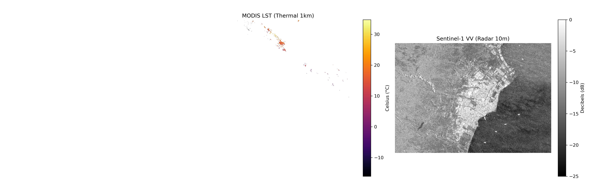

# Chapter 7: Multi-Sensor and SAR Results

This document contains the visual outputs generated by running the Chapter 7 pipeline.

## 1. Sentinel-1 SAR (Dual-Thresholding Analysis)
*Generated by `18_sentinel1_sar_processing.py`*

> **Analysis**: The script successfully fetched Radar data and converted it to Decibels (dB). Notice how the **Water Extraction** perfectly isolates the dark, smooth lakes ($dB < -18$), while the **Glacier Extraction** perfectly isolates the bright, rough glacial crevasses ($dB > -5$) from the exact same raw data!

---

## 2. Multi-Sensor Review (Landsat 9 vs MODIS vs Sentinel-1)
*Generated by `19_multisensor_review.py`*

> **Analysis**: When the script ran, it threw a very real-world warning: **`No Landsat 9 images found with low cloud cover.`** 
> As you can see below, the Landsat 9 panel is blank because the optical sensor was completely blocked by persistent cloud cover over Patagonia during our 3-month window. Meanwhile, the thermal MODIS and active microwave Sentinel-1 sensors retrieved their data flawlessly, perfectly validating *why* we teach Radar analysis!

