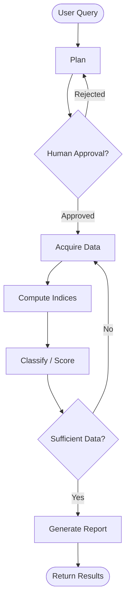

# Chapter 10: Agentic Orchestration (LangGraph)

> [!IMPORTANT]
> **Status: 🚧 Planned / In Development**
> This chapter introduces autonomous AI agent design for geospatial workflows. The architectural plan below defines the complete system.

## 🎯 Academic Objective

The previous chapters required you to manually decide which scripts to run, in which order, for which region. An **agentic system** removes this burden: given a natural-language question like *"What is the glacial flood risk near coordinates [-73.1, -50.9]?"*, the agent autonomously plans, acquires data, runs the analysis pipeline, and returns a structured report.

This chapter uses **LangGraph** — a framework for building stateful, cyclic agent workflows — to orchestrate the entire GeoCascade pipeline as an autonomous AI agent.

By the end of this chapter you will be able to:
- Design a stateful agent graph with nodes, edges, and conditional routing
- Implement geospatial tool functions callable by an LLM
- Build human-in-the-loop approval gates to prevent expensive API calls without confirmation
- Understand when agentic approaches are (and aren't) appropriate for scientific workflows

---

## 🏗️ Agent State Graph



**State schema:**
```python
class GeoAgentState(TypedDict):
    query: str              # Natural language question
    bbox: list[float]       # Derived BBOX from query
    date_range: str         # Derived date range
    plan: str               # Agent's analysis plan
    data: dict              # Downloaded raster layers
    indices: dict           # Computed spectral/composite indices
    report: str             # Final Markdown report
    approved: bool          # Human approval flag
```

---

## 🛠️ Agent Tools (Planned)

| Tool | Description | Chapter Origin |
|------|-------------|---------------|
| `stac_query_tool` | Download Sentinel-2, SAR, DEM for any BBOX | Ch 1 |
| `compute_indices_tool` | Run NDVI, NDSI, NDWI, etc. | Ch 2 |
| `dem_analysis_tool` | Compute slope, aspect, watershed | Ch 3 |
| `fusion_tool` | Build multi-sensor data cube | Ch 8 |
| `insights_tool` | Compute ESI, CVS, WSI scores | Ch 8 |
| `report_generator_tool` | Write Markdown report from results | Ch 12 |

---

## 📂 Planned Files

| File | Description |
|------|-------------|
| `27_agent_tools.py` | All geospatial tool functions with typed inputs/outputs |
| `28_agent_graph.py` | LangGraph state graph definition + node functions |
| `29_run_agent.py` | CLI entry point — takes natural language query |

---

## 🚀 Planned Installation

```bash
pip install langgraph langchain langchain-google-genai
mamba install -n geocascade_env -c conda-forge pystac-client planetary-computer rasterio geopandas -y
```

**Example Usage:**
```bash
python 29_run_agent.py --query "Analyze ecological stress in Torres del Paine for January 2023"
```

---

## 🗺️ Example Agent Conversation

```
User: "What is the current glacier vulnerability near the Grey Glacier?"

Agent: [Plan] I will download Sentinel-2, Sentinel-1 SAR, and MODIS LST
       for the Grey Glacier BBOX and compute the CVS composite score.

       [Human Gate] This requires ~500MB download and ~3 min runtime.
       Approve? (y/n): y

       [Acquire] Downloading 4 sensor layers...
       [Compute] CVS mean = 0.73 — HIGH cryosphere vulnerability
       [Report] 3 zones show CVS > 0.8, indicating active surface melt.
                Recommend immediate field survey and hydrological monitoring.
```

---

## 📚 Academic References

- Yao, S. et al. (2022). ReAct: Synergizing Reasoning and Acting in Language Models. *arXiv:2210.03629*.
- LangGraph Documentation: [langchain-ai.github.io/langgraph](https://langchain-ai.github.io/langgraph)
- Maxwell, A.E. & Warner, T.A. (2023). Automation in Remote Sensing: A Review. *Remote Sensing*.
